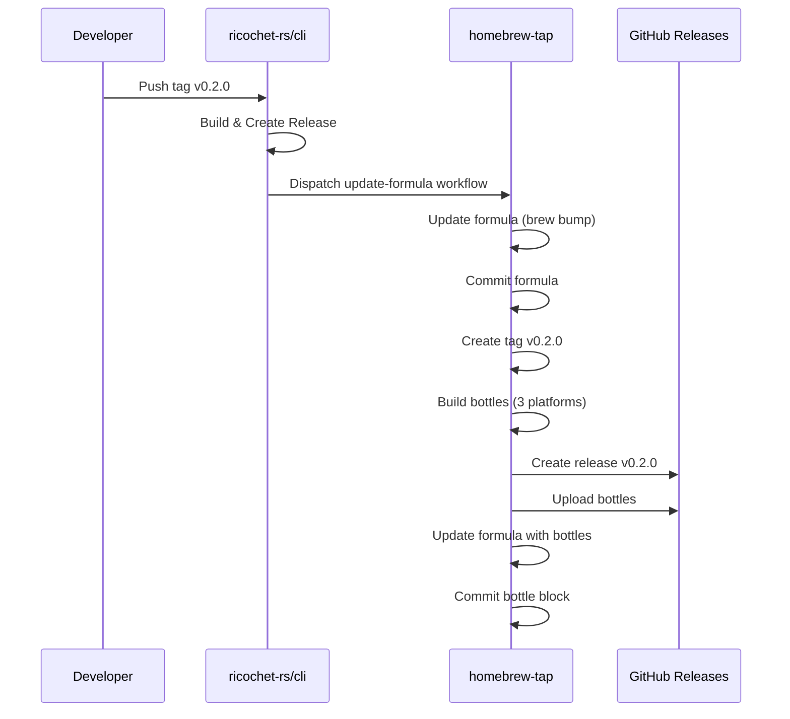

# Upstream Integration Guide

This document explains how to automatically update the Homebrew formula when `ricochet-rs/cli` creates a new release.

## Overview

When a new version is released in `ricochet-rs/cli`, the release workflow triggers the homebrew-tap update workflow which automatically:

1. Updates the formula with the new version and SHA256
2. Creates a tag in homebrew-tap (e.g., `v0.2.0`)
3. Builds bottles for all platforms (macOS Sequoia, Sonoma, Ventura)
4. Creates a GitHub release with bottles
5. Updates the formula with bottle block

## Setup in ricochet-rs/cli Repository

### 1. Create a Personal Access Token (PAT)

You need a GitHub PAT with `repo` and `workflow` scopes to trigger workflows in the homebrew-tap repository.

1. Go to https://github.com/settings/tokens/new
2. Set description: "Trigger homebrew-tap workflows"
3. Select scopes:
   - ✅ `repo` (Full control of private repositories)
   - ✅ `workflow` (Update GitHub Action workflows)
4. Generate token and copy it

### 2. Add Token as Secret

In the `ricochet-rs/cli` repository:

1. Go to Settings → Secrets and variables → Actions
2. Click "New repository secret"
3. Name: `HOMEBREW_TAP_TOKEN`
4. Value: Paste your PAT
5. Click "Add secret"

### 3. Add Workflow Dispatch Step to Release Workflow

Add this step to your release workflow in `ricochet-rs/cli/.github/workflows/release.yml`:

```yaml
- name: Trigger Homebrew tap update
  if: github.event_name == 'push' && startsWith(github.ref, 'refs/tags/v')
  env:
    GH_TOKEN: ${{ secrets.HOMEBREW_TAP_TOKEN }}
  run: |
    VERSION=${GITHUB_REF#refs/tags/}
    echo "Triggering homebrew-tap update for ${VERSION}"

    gh workflow run update-formula.yml \
      --repo ricochet-rs/homebrew-tap \
      --ref main \
      --field "version=${VERSION}"
```

### Example Complete Release Workflow

Here's an example of what your `ricochet-rs/cli` release workflow might look like:

```yaml
name: Release

on:
  push:
    tags:
      - "v*"

jobs:
  release:
    runs-on: ubuntu-latest
    steps:
      - name: Checkout
        uses: actions/checkout@v4

      # Your build steps here...

      - name: Create GitHub Release
        env:
          GITHUB_TOKEN: ${{ secrets.GITHUB_TOKEN }}
        run: |
          VERSION=${GITHUB_REF#refs/tags/}
          gh release create "${VERSION}" \
            --title "Release ${VERSION}" \
            --notes "Release notes here"

      - name: Trigger Homebrew formula update
        env:
          GH_TOKEN: ${{ secrets.HOMEBREW_TAP_TOKEN }}
        run: |
          VERSION=${GITHUB_REF#refs/tags/}
          echo "Triggering homebrew-tap update for ${VERSION}"

          gh workflow run update-formula.yml \
            --repo ricochet-rs/homebrew-tap \
            --ref main \
            --field "version=${VERSION}"

          echo "✅ Homebrew tap update triggered"
          echo "Check progress at: https://github.com/ricochet-rs/homebrew-tap/actions"
```

## How It Works



## Workflow Sequence

1. **Developer creates tag in ricochet-rs/cli:**

   ```bash
   git tag v0.2.0
   git push origin v0.2.0
   ```

2. **ricochet-rs/cli release workflow runs:**
   - Builds binaries
   - Creates GitHub release
   - Triggers homebrew-tap `update-formula` workflow

3. **homebrew-tap `update-formula.yml` runs:**
   - Updates formula with `brew bump-formula-pr`
   - Commits updated formula
   - Creates tag `v0.2.0` in homebrew-tap
4. **Tag creation triggers `publish.yml`:**
   - Builds bottles for all platforms
   - Creates release in homebrew-tap
   - Uploads bottles
   - Updates formula with bottle block

## Manual Trigger (Optional)

You can also manually trigger a formula update from the GitHub UI:

1. Go to https://github.com/ricochet-rs/homebrew-tap/actions/workflows/update-formula.yml
2. Click "Run workflow"
3. Enter the version (e.g., `v0.2.0` or `0.2.0`)
4. Click "Run workflow"

## Testing

To test the integration:

1. Create a test tag in `ricochet-rs/cli`:

   ```bash
   git tag v0.1.1
   git push origin v0.1.1
   ```

2. Verify the workflow was triggered in homebrew-tap:

   ```bash
   gh run list --repo ricochet-rs/homebrew-tap
   ```

3. Check the Actions tab in homebrew-tap:
   - Should show "Update Formula" workflow running
   - Followed by "Build and Publish Bottles"

4. Verify the results:
   - Formula updated to v0.1.1
   - Tag `v0.1.1` created in homebrew-tap
   - Release created with bottles
   - Formula has bottle block

## Troubleshooting

### "Resource not accessible by integration" error

- The PAT doesn't have sufficient permissions
- Solution: Recreate the PAT with both `repo` and `workflow` scopes

### Workflow doesn't trigger

- Check that `HOMEBREW_TAP_TOKEN` secret exists in ricochet-rs/cli
- Verify the PAT has `workflow` scope
- Check that the workflow file name is correct (`update-formula.yml`)

### Formula update fails

- Check that the source tarball exists at the expected URL
- Verify the version format matches expectations (e.g., `v0.2.0`)
- Review the workflow logs for specific errors

### Bottles not building

- Verify the tag was created in homebrew-tap
- Check that `publish.yml` triggers on tags matching `v*`
- Look at the "Build and Publish Bottles" workflow logs

### Python linking errors

- This should be fixed automatically by the workflow
- If issues persist, check the build logs for specific errors
